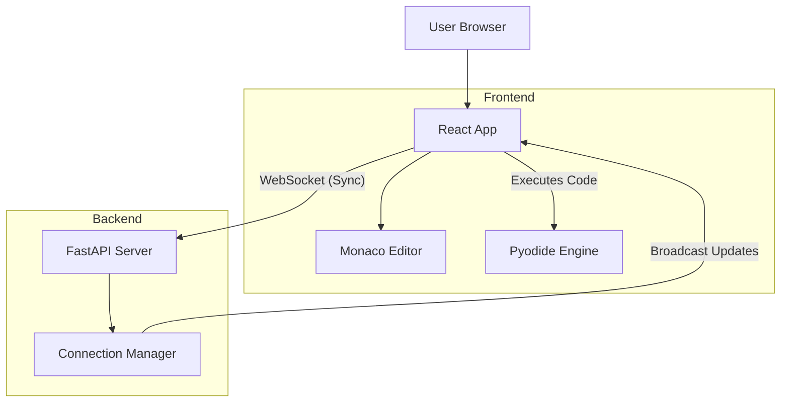

<div align="center">

<h1>CodeSync</h1>

**A real-time collaborative online coding platform.**

<br>

Write, share, and solve problems together with instant synchronization and browser-based code execution.

[Report Bug](https://github.com/UtkarshRai14/codeSync/issues) · [Request Feature](https://github.com/UtkarshRai14/codeSync/issues)

</div>

---

## 🚀 Key Features

* **Real-time Collaboration**: Instant code synchronization between participants using WebSockets. See changes as they happen.

* **Browser-based Execution**: Execute Python code directly in the browser using [Pyodide](https://pyodide.org/) — fast, secure, and no backend execution overhead.

* **Session Management**: Diverse interview sessions with unique shareable links.

* **Presence Indicators**: Real-time list of active participants in the session.

* **Beautiful UI**: Modern, dark-themed interface built with TailwindCSS and shadcn/ui.

* **Syntax Highlighting**: Rich code editing experience powered by Monaco Editor (VS Code).

## 🛠️ Tech Stack

### Frontend

* **Framework**: [React](https://react.dev/) + [Vite](https://vitejs.dev/)
* **Language**: TypeScript
* **Styling**: [TailwindCSS](https://tailwindcss.com/) + [shadcn/ui](https://ui.shadcn.com/)
* **Animations**: [Framer Motion](https://www.framer.com/motion/)
* **Editor**: [Monaco Editor](https://microsoft.github.io/monaco-editor/)
* **Runtime**: [Pyodide](https://pyodide.org/) (WebAssembly Python)
* **Testing**: Vitest + React Testing Library

### Backend

* **Framework**: [FastAPI](https://fastapi.tiangolo.com/) (Python 3.13)
* **Networking**: WebSockets for real-time events
* **Manager**: [uv](https://github.com/astral-sh/uv) (Fast Python package installer)
* **Testing**: Pytest

### DevOps

* **Containerization**: Docker
* **CI/CD**: GitHub Actions

## 🏗️ Architecture



## 🏁 Getting Started

### Prerequisites

* **Node.js**: v20+
* **Python**: v3.13+
* **Docker** (Optional, for containerized run)

### Local Development

#### 🚀 Quick Start (Recommended)

Run the entire application (Frontend + Backend) with a single command:

1. **Install all dependencies**

   ```bash
   npm run install:all
   ```

2. **Run Development Server**

   ```bash
   npm run dev
   ```

   * Frontend: `http://localhost:5173`
   * Backend: `http://localhost:8000`

#### 🐢 Manual Setup

If you prefer to run services individually:

**Backend (using Makefile)**

```bash
cd backend

make install
make dev
```

Other useful commands:

* `make test`: Run tests
* `make lint`: Check linting
* `make format`: Format code

**Frontend**

```bash
cd frontend

npm install
npm run dev
```

### 🐳 Docker Support

Run the entire stack with a single command:

```bash
docker build -t codesync .

docker run -p 8080:8080 codesync
```

Open `http://localhost:8080` to see the app running.

## 📂 Project Structure

```text
codeSync/

├── .github/                # GitHub Actions workflows
├── backend/                # FastAPI Application
│   ├── app/                # Source code
│   │   ├── api/            # API Routes
│   │   ├── websocket/      # WebSocket Handlers
│   │   └── main.py         # Entry point
│   ├── tests/              # Pytest tests
│   ├── generate_openapi.py # OpenAPI spec generator
│   ├── Makefile            # Backend make commands
│   ├── openapi.json        # Generated OpenAPI spec
│   └── pyproject.toml      # Python dependencies
├── frontend/               # React Application
│   ├── public/             # Static assets (favicon)
│   ├── src/
│   │   ├── components/     # Reusable UI components
│   │   ├── hooks/          # Custom React hooks
│   │   ├── lib/            # Utilities (Pyodide, API)
│   │   ├── pages/          # Route pages
│   │   └── types/          # TypeScript definitions
│   └── vite.config.ts      # Vite configuration
├── Dockerfile              # Multi-stage Docker build
└── package.json            # Root configuration
```

## 🧪 Running Tests

**Run All Tests**

```bash
npm test
```

**Backend Only**

```bash
cd backend
make test
```

**Frontend Only**

```bash
cd frontend
npm run test
```

## 📖 API Documentation

Since the backend is built with FastAPI, interactive API documentation is automatically generated.

Once the backend is running at `http://localhost:8000`, you can access:

* **Swagger UI**: `http://localhost:8000/docs` — Interactive API exploration.
* **ReDoc**: `http://localhost:8000/redoc` — Alternative documentation format.
* **OpenAPI Spec**: `http://localhost:8000/openapi.json` — Raw JSON specification.

To generate the `openapi.json` file manually without running the server:

```bash
cd backend
uv run python generate_openapi.py
```

## 🤝 Contributing

Contributions are welcome! Please feel free to submit a Pull Request.

1. Fork the project.
2. Create your feature branch (`git checkout -b feature/AmazingFeature`).
3. Commit your changes (`git commit -m 'feat: add some AmazingFeature'`).
4. Push to the branch (`git push origin feature/AmazingFeature`).
5. Open a Pull Request.

